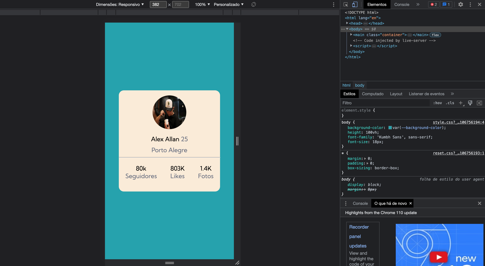
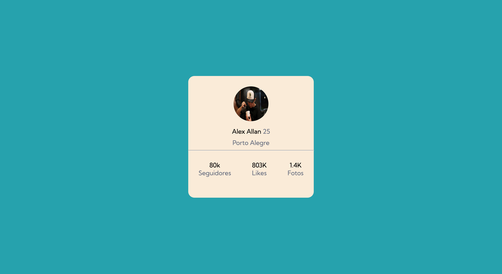

# Descrição Do Projeto Profile Card - DevEmDobro 

Esse exercício é uma ALTERNATIVA ao desafio  Frontend Mentor | Profile card component coding challenge. Onde o principal desafio é criar um cartão que contenha as informações de perfil. Para ser aprimorado as habilidades de posicionamento de elementos usando flexbox. 

## Prints  
### Disign Mobile

### Disign Desktop 

# Feramenta Utilizada: 
- CSS3
- HTML5